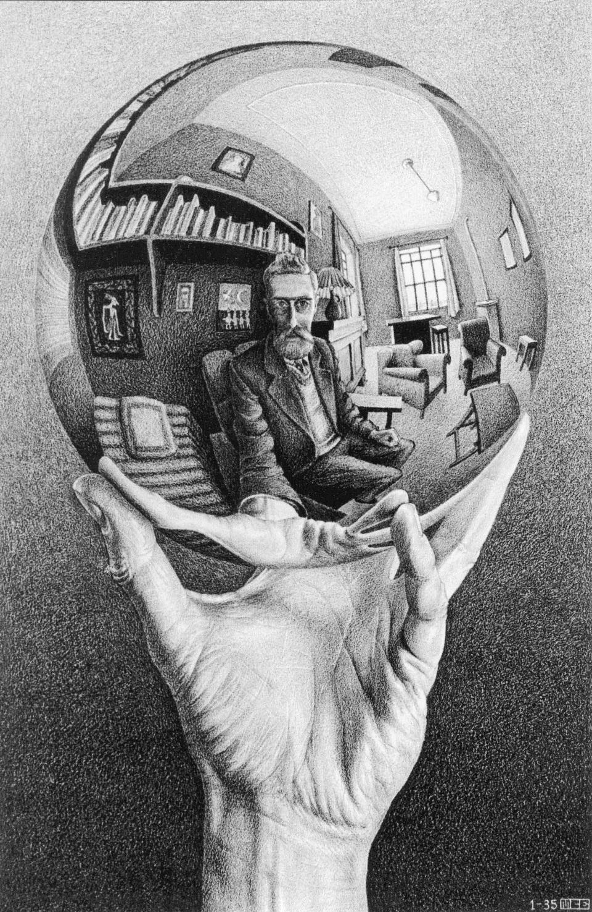

# Fast Style Transfer ( [Magenta](https://github.com/magenta/magenta/tree/master/magenta/models/arbitrary_image_stylization) )

This code load and apply the fast arbitrary style transfer model using the tensorflow hub. I did it to test the model by myself.

This model is a distinc approach to the style transfer models. The [original work](https://arxiv.org/abs/1508.06576) realized the style transfer by continuously iterating over some VGG019 layers, wich was a slow method. [Other models](https://arxiv.org/abs/1610.07629) have done an optimization creating different networks for each style. In that way, you could do real time style transfer, but it was limited by a set of styles. [This method](https://arxiv.org/abs/1705.06830) does arbitrary style transfer in real time. It achieves that by training a network that predict the style in addition to the others networks used in the older methods.

## Files

- [sample content images](./sample_contet_images) : folder that contains some images to use as contet images (to be stylized).
- [sample style images](./sample_style_images) : folder that contains some style images to apply on the contet images.
- [output images](./output_images) : folder that contains the stylized images.
- [1.in](./1.in) : a file containing an input example for the application.
- [test_model.py](./test_model.py) : the source code.

## Input parameters

1. content_image.jpg (name of the content image inside the sample_content_images folder)
2. sytle_image.jpg (name of the style image inside the sample_style_images folder)
3. output_image.jpg (name of the image to be saved inside the output_images folder)
4. (0-1) (0 to not resize the style image, 1 to resize)
    1. (x) (new number of pixels in the x axis)
    2. (y) (new number of pixels in the y axis)
    3. (0-1) (to preserve (1) the aspect ratio in the resize or not (0) )

* I would like to notice that smaller style images seens to tranfer better the style. I personally think that the 256x256 size works the best.

## Output examples

<table>
    <tr>
        <td></td>
        <td></td>
        <td></td>
    </tr>
    <tr>
        <td></td>
        <td></td>
        <td></td>
    </tr>
    <tr>
        <td></td>
        <td></td>
        <td></td>
    </tr>
</table>